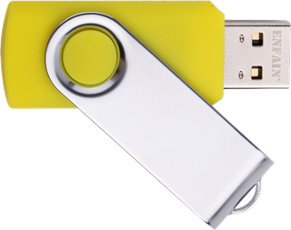
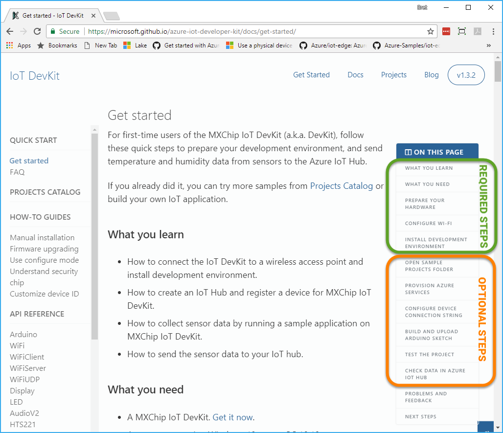

# 01 - Prepare the Azure IoT Development Kit Board

The team behind the Azure IoT Developer Kit MXChip board works tirelessly to help you be successful.  That work results in updates that you want to be sure to use:

  - Updated firmware for the board itself
  - Updated Development Kit which includes the tools necessary to create and deploy code onto the board. 

In this exercise, you'll walk through the steps necessary to upgrade the fimrware on your board to the latest version as well as to download and install the latest version of the Developer Kit.  

The team keeps the documentation for performing those steps up to date as well, so there isn't much value in repeating it here.  Better to just go to the documentation for the board itself, and complete the steps outlined there. 

So, your task is to:

1. If you are at a live event, check with your event organizers to see if they have a USB stick available with all of the necessary downloads on it.  This will help save tim downloading large files and keep the venue network from becoming congested.  If a drive exists, copy (NOT MOVE) the contents to your laptop, and return the USB stick to the organizers or pass it along to another attendee who needs it!

    > **Note**: If you have access to a USB stick with the necessary files on it at an event, make sure to use the Firmward and DevKit versions on the USB stick rather than downloading them.  That will help ensure that you are using a tested version of the Firmware and DevKit and that you match the rest of the attendees at the event.

    

1. Gather the WiFi information you will need to connect your board to the internet.  You will need to know the SSID and Password of the network you wish to use.

    > **Note**:  If you have problems using the WiFi connection method documented in the Get Started guide below, you can attempt to use the manual wifi configuration instructions here: <a href="https://github.com/BretStateham/azure-iot-devkit-manual-wifi" target="blank">Azure IoT Developer Kit Manual WiFi Configuration</a>

1. Follow the <a href="https://microsoft.github.io/azure-iot-developer-kit/docs/get-started/" target="_blank">Get Started</a> guide for the board.  These steps will help you prepare the board, and your computer to work with the board.  You only need to complete the steps shown as "**REQUIRED STEPS**" in the image below.  You can optionally choose to complete the "**OPTIONAL STEPS**" as well.  Those steps will give you an opportunity to deploy a different sample to your board initially, although you will replace it later as you complete the remaining steps in this lab.

    

    > **Note**: If you are attending a live workshop, you may have access to a USB stick that has the necessary files on it to save download time and venue network bandwith.  Check with your event organizers to see if a drive is available.

    Make sure in "**Step 5. Prepare the development enviornment**", to select the proper platform for the OS you are running on your laptop:

    

    As you complete the Get Started Guide you will

      - Upgrade the firmware to the latest version
      - Download and install the latest Development Kit for the board.

1. When you have successfully prepared your board, you're ready to move on to lab "[02 - Deploy and Verify Your Resources in Azure](./flysimexpress-02.md)"
