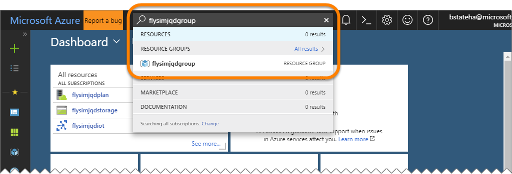
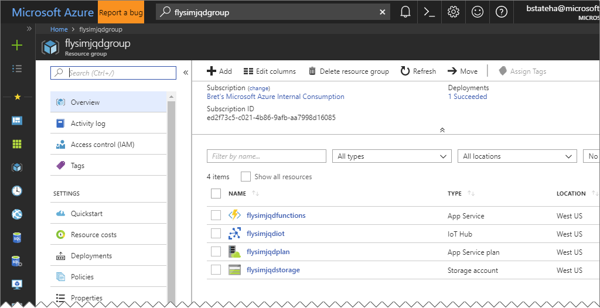

# 02 - Deploy and Verify Your Resources in Azure

## Lab Overview

If you recall from the overview, the overall architecture for this lab looks like this:


In this lab, you will deploy the resources colored blue up above. Those resources include

  - An Azure IoT Hub.  This is where your MXChip board will send it's accelerometer data to.  In the full workshop, this is also where your board will proximity warning messages from the cloud.

  - An Azure Function.  This function is triggered and runs automatically whenever a new message is received by the Azure IoT Hub from your board.  The function takes the accelerometer data from the board and uses it to create hypothetical flight data (pitch, roll, altitude, heading, latitude and longitude) for a virtual plane.  It persists that state to an Azure Storage Table so it can recall, then update your virtual plane's flight data appropriately with each subsequent message from your board.

  - An Azure Storage Account.  The Azure Storage Account is used by Azure Functions.  The Azure Functions runtime actually uses it for various internal logging, queueing and monitoring purposes.  Our function will use it specifically to persist your virtual flight data between messages from your device.

## Azure Portal, CLI Commands or Templates?  

When you are deploying resources in Azure, you have a number of methods available to you.  The Azure Portal, The Azure Command Line Interface (CLI), and Azure Resource Manager (ARM) Templates. 

- **The Azure Portal**: You could use the Azure Portal at <a href="https://portal.azure.com" target="_blank">http://portal.azure.com</a>.  The portal gives you a powerful and visual way to create an manage your resources in your Azure subscriptions.  However, doing it this way takes the longest.  For an "Express" lab, it will likely slow new users down enough that it could become a time constraint.

- **The Azure Command Line Interface (CLI)**: The CLI allows you to create, query, and manage ***nearly** all the resources available to you in Azure.  It is extremely powerfull and the team is constantly increasing the resource types it can manage.  In addition, the CLI is availble in the "<a href="https://docs.microsoft.com/en-us/azure/cloud-shell/overview" target="_blank">Cloud Shell</a>" which makes it easy to use even on machines where it isn't installed.

- **Azure Resource Manager (ARM) Templates**: When you are looking to encapsulate all the resources needed for a solution into a single definition, deploy it across environments (dev, test, production) and regions (US, Europe, Asia), ARM templates are your best choice.  They also make it possible to deploy complex architectures simply and expediently. 

In this lab, we'll use a combination of the Azure CLI and ARM Templates.  Yes, we could walk you step by step through creating each resource in the portal, but those steps are fully documented elsewhere, and this lab would become difficult to maintain with lots of screen shots to portal interfaces that change regularly. In addition simply by having to click on a bunch of links, type in a bunch of boxes, and click a bunch of buttons, the time it would take to deploy the resources for this lab with be significantly longer.

If you want a more step-by-step lab experience, you can view the <a href="http://aka.ms/flysim" target="_blank">full version</a> of this workshop at a later time.

## The "myresources.txt" File

Throughout this lab, you will be creating a number of resources. You will need to refer to those resources later in the lab so it is helpful to keep track of all the information you need in a single place. 

To help you do that, a file called `myresources.txt.sample` has been provided in the "Labs" folder whereever you extracted this workshop content to.  You should create a ***copy*** of that file in the same folder, and just name it `myresources.txt`. We'll instruct you periodically to make note of your resources details in that file through this lab.

___
<a name="Exercises"></a>

## Exercises


- [Choose a Name Prefix](#Exercise1)
- [Login to the Azure CLI](#Exercise2)
- [Deploy the ARM Template](#Exercise3)
- [Verify your Resources in the Portal](#Exercise4)

___
<a name="Exercise1"></a>

### Choose a Name Prefix

When you create resources in Azure, you must give them a name, most resources (web sites, function apps, event hub namespaces, storage accounts, etc.) use their name as a part of the URL used to access them.  For this reason, the names you choose must be globally unique. In addition when you encounter resources in the portal, or wherever, it is helpful if the name you use indicates what the resource is, and why you created it.  For that reason, you should come up with a consistent naming scheme for your resources.  In addition, many of the resources require names to be ***lowercase only*** and to include only valid url characters.  To that end, it is suggested that you use a naming scheme in this lab similar to the following

***&lt;name_prefix&gt;resourcetype***

Where:

- ***&lt;name_prefix&gt;*** is a something like ***flysim*** (to let you know it came from this lab) and your first middle and last initials (to help keep it unique).  For example, if your name were "John Q. Doe", you might use ***flysimjqd*** as your ***&lt;name_prefix&gt;*** .

- ***resourcetype*** gives you some sort of indication of the kind of resource:

  - ***group*** for a Resource Group
  - ***iot*** for an iot hub
  - ***storage*** for a storage account
  - ***functions*** for an Function App
  - ***ns*** for an Event Hub Namespace

- Again using the example ***&lt;name_prefix&gt;*** of ***flysimjqd*** from above, and the suggested ***resourcetype*** names, we might name our resources like this:
 
  - ***flysimjqdgroup*** for a Resource Group
  - ***flysimjqdiot*** for an iot hub
  - ***flysimjqdstorage*** for a storage account
  - ***flysimjqdfunctions*** for an Function App
  - ***flysimjqdns*** for an Event Hub Namespace

- Honestly, it doesn't matter what you use as your ***&lt;name_prefix&gt;*** as long as it helps generate globally unique names.  However, for the remainder of this lab, we will assume the naming convention outlined above.  If you use a different name, you will need to keep track of your resource names.

1. Using the information above, choose the ***&lt;name_prefix&gt;*** you wish to use.

1. Open the `Labs/myresources.txt` file (or create a copy of the `Labs/myresources.txt.sample` file and name it `Labs/myresources.txt` if you haven't done so already), and document that name prefix you chose there, and save your changes:

    For example, using our ***&lt;name_prefix&gt;*** of ***flysimjqd*** we could change the following in the `Labs/myresources.txt` file:

    ```text
    ========================================
    Name Prefix
    ========================================

    Document your name prefix here:
    <paste your Naming convention prefix here>
    ```

    to

    ```text
    ========================================
    Name Prefix
    ========================================

    Document your name prefix here:
    flysimjqd
    ```

___
<a name="Exercise3"></a>

### Login to the Azure CLI

When you installed the Azure IoT Developer Kit in Lab [01 - Prepare the Azure IoT Development Kit Board](flysimexpress-02.md), it should have installed the "<a href="https://docs.microsoft.com/en-us/cli/azure/install-azure-cli" target="_blank">Azure CLI 2.0</a>" for you.  The Azure CLI is a cross-platform command line interface (CLI) that allows you to easily manage your resources in Azure from the command line. In this exercise, we'll make sure that the Azure CLI is working, and that you are logged into it. 

### Use PowerShell on Windows

For those completing the workshop with macOS, you can ignore this section.  However, for those using Windows 10 computers for the workshop, you should make sure to complete all of the command line statements, etc. using PowerShell, not the Command Prompt (cmd) or the Windows Subsystem for Linux (WSL/bash).  There are some commands we will use later as part of the deployment of code to the device that only work in PowerShell, and sticking to PowerShell will help to ensure your success.

1. On your computer, open a PowerShell prompt (Windows) or terminal (macOS). From the prompt simply type the command `az` and press **Enter**:

    ```bash
    az
    ```
    You should see output similar to the following abbreviated example.  Take a moment to review the list of commands available. 
    ```bash
        /\
       /  \    _____   _ _ __ ___
      / /\ \  |_  / | | | \'__/ _ \
     / ____ \  / /| |_| | | |  __/
    /_/    \_\/___|\__,_|_|  \___|


    Welcome to the cool new Azure CLI!

    Here are the base commands:

        account          : Manage Azure subscription information.
        acr              : Manage Azure Container Registries.
        acs              : Manage Azure Container Services.

        ...
    ```

1. Next, run the following command to verify that you are using Azure CLI 2.0 or later

    ```bash
    az --version
    ```

    And in on the first line of the output, verify the azure-cli version is greater than 2.0:

    ```bash
    azure-cli(2.0.20)
    ```

1. If either of the above commands did not succeed, you need to ensure that you have the Azure CLI 2.0 or later installed.  Complete the steps on the <a href="https://docs.microsoft.com/en-us/cli/azure/install-azure-cli?view=azure-cli-latest" target="_blank">Install Azure CLI 2.0</a> page for your platform before continuing.

1. You need to login to your subscription from the Azure CLI to give it the permissions it needs to manage your resources.  To login, issue the following command from the prompt:

    ```bash
    az login
    ```

1. You will be given a code to paste into the web page at <a href="" target="_blank">http://aka.ms/devicelogin</a> web page.  For example, in the output below, the code provided is **`BLYVMR24X`**.  

    - Copy the code provided to you in the terminal window to your clipboard, 
    - In your browser, navigate to 
    - Paste the code from the terminal into the box on the web page
    - Authenticate using the credentials for the Azure Subscription you wish to use for the workshop.

    ```bash
    To sign in, use a web browser to open the page https://aka.ms/devicelogin and enter the code BLYVMR24X to authenticate.
    ```
1. And once you successfully login on the web, page, you should see output similar to the following in the terminal window:

    ```bash
    [
      {
        "cloudName": "AzureCloud",
        "id": "xxxxxxxx-xxxx-xxxx-xxxx-xxxxxxxxxxxx",
        "isDefault": true,
        "name": "Your Subscription Name",
        "state": "Enabled",
        "tenantId": "yyyyyyyy-yyyy-yyyy-yyyy-yyyyyyyyyyyy",
        "user": {
          "name": "you@yourcompany.com",
          "type": "user"
        }
      }
    ]
    ```

1. Verify that the correct subscription is being used by running the following command, and verifying that the subscription you wish to use:

    ```bash
    az account show
    ```

1. If the correct account and subscription weren't returned above, you can use the following commands (add `--help` to the end of a command to get help with it) to specify the correct subscription:

    ```bash
    az account list --help
    ```

    and

    ```bash
    az account set --help
    ```
___
<a name="Exercise3"></a>

### Deploy the ARM Template

Finally, we're ready to deploy our resources to Azure.  As mentioned above we'll be using an existing Azure Resource Manager (ARM) template to create the resources quickly and consistently.

1. Still in your PowerShell prompt or Terminal Window, change into the `AzureResources/Attendee` folder under where you extracted the workshop content to. For example, if you extracted the workshop zip file to a folder name `/FlySimExpress` off the root of your hard drive, you would enter:

    ```bash
    cd /FlySimExpress/AzureResources/Attendee
    ```

1. View the contents of the `template-exress.json` file in that folder.  This is the ARM template that will deploy our resources for this lab.

    > **Note**: If you prefer, open the `template-express.json` file in Visual Studio Code to make it easier to read, **BUT DO NOT MAKE CHANGES TO THE FILE**.  You may also notice the `template-full.json` file.  That is the template to create the resources for the full workshop (http://aka.ms/flysim).  It's the same as the express template with the addition of creating the Event Hub Namespace and Event Hub needed for the client side FlySim UWP app.  You can safely ignore that file for this express version of the workshop though.

    ```bash
    cat template-express.json
    ```

1. Review the contents of the file. It might look a little overwhelming at first, but it's really not that complex.  It has a number of top level JSON properties, each with their own configuration, the following example shows just the interesting pieces:

    ```JSON
    {
      "parameters": {
        "name_prefix": {
          "defaultValue": "name",
          "type": "string"
        }
      },
      "variables": {
        "location": "[resourceGroup().location]",
        "iotHubName": "[concat(parameters('name_prefix'),'iot')]",
        "storageAccountName": "[concat(parameters('name_prefix'),'storage')]",
        ...
      },
      "resources": [
        {
          "comments": "Provision the IoT Hub",
          "type": "Microsoft.Devices/IotHubs",
          ...
        },
        {
          "comments": "Provision the Storage Account",
          "type": "Microsoft.Storage/storageAccounts",
          ...
        },
        {
          "comments": "Provision the consumption plan",
          "type": "Microsoft.Web/serverfarms",
          ...
          }
        },
        {
          "comments": "Provision the Function App",
          "type": "Microsoft.Web/sites",
          ...
            "siteConfig": {
              "appSettings": [
                {
                  "name": "AzureWebJobsStorage",
                  "value": "..."
                },
                {
                  "name": "IoTHubConnection",
                  "value": "..."
                },
                {
                  "name": "SharedEventHubConnection",
                  "value": "<SHARED EVENT HUB CONNECTIONSTRING AND ENTITY PATH PROVIDED BY THE PRESENTER>"
                }
              ]
            }
          }
        }
      ]
    }
    ```

1. Here's a quick explanation of the top level JSON objects.  Take some time to peruse the contents of the file, **BUT DO NOT MAKE ANY CHANGES TO IT**

    - `"parameters"` - Where you supply any inputs, the **`"name_prefix"`** in our case.  This will help to enforce the naming convention we discussed above.
    - `"variables"` - This creates the values used to configure the resources.  In our case, it creates the names for our resources using the ***&lt;name_prefix&gt;resourcetype*** naming convention as well as to ensure all the resources are created in the same region as the resource group that contains them.
    - `"resources"` - Provides the configuration for each of the resources we need to provision.
      - IoT Hub
      - Storage Account
      - Consumption Plan, the execution engine for our Function
      - Function App, the container of the code for our Function
      - Within the Function App, there are a number of `appSettings`.  These make sure that the Function App has the ability to connect to the Storage Account, IoT Hub, and Share Event Hub created by the presenter.  We'll use those connections in later labs.

1. Before we can deploy the template, we must first create a resource group in the **`westus`** region (we are hard coding all of the resources for this workshop to run in the **West US** region). To do so, back in the terminal window, run the following command (replacing the ***&lt;name_prefix&gt;*** place holder with your prefix), and verifying that the command completes successfully:

    > **Note**: Resource Groups provide a deployment and administrative boundary around a collection of resources.  By placing all of the resources for this workshop in a single Resource Group you will be able to easily locate them, as well as easily delete them all at the end by simply deleting the Resource Group they are in.

    ```bash
    az group create --resource-group <name_prefix>group --location westus
    ```

    For example, using our ***flysimjqd*** name prefix, we would run:

    ```bash
    az group create --resource-group flysimjqdgroup --location westus
    ```

    In the output, verify that the **`"provisioningState"`** property reads **`"Succeeded"`**:

    ```bash
    {

      ...

      "name": "flysimjqdgroup",
      "properties": {
        "provisioningState": "Succeeded"
      },

      ...

    }
    ```
1. You're now ready to deploy the resources defined in the template.  Run the following command, and verify there are no errors in the terminal window.  Again, replace the ***&lt;name_prefix&gt;*** place holder with your prefix.  ***THIS COMMAND WILL TAKE A FEW MINUTES TO COMPLETE. PLEASE GIVE IT TIME TO FINISH***:

    > **Note**: While the line my appeared wrapped in this document, you need to enter it on a single line in the terminal window.

    ```bash
    az group deployment create --name "FlySimAttendee" --resource-group <name_prefix>group --template-file .\template.json --parameters name_prefix=<name_prefix>
    ```

    With our ***flysimjqd*** sample prefix:

    ```bash
    az group deployment create --name "FlySimAttendee" --resource-group flysimjqdgroup --template-file .\template.json --parameters name_prefix=flysimjqd
    ```

1. The command above will produce a lot of output, just ensure that there are no errors.  Near the end you similar to before you should see a **`"provisioningState": "Succeeded"`**. Verify that everything worked before proceeding.
___
<a name="Exercise4"></a>

### Verify your Resources

Awesome, at this point you've used the Azure CLI and an ARM Template to deploy a collection of resources into a Resource Group in Azure. In this section, we'll show you how to verify the resources exist in Azure. 

1. Back in your PowerShell prompt or Terminal Window, run the following command to view the resources in the resource group we just created. As before, replace the ***&lt;name_prefix&gt;*** place holder with your name prefix:

    ```bash
    az resource list --resource-group <name_prefix>group
    ```

    Using our ***flysimjqd*** example prefix:

    ```bash
    az resource list --resource-group flysimjqdgroup
    ```

    And verify that you can see the resources we created above:

    ```JSON
    [
      {
        ...
        "type": "Microsoft.Devices/IotHubs"
      },
      {
        ...
        "type": "Microsoft.Storage/storageAccounts"
      },
      {
        ...
        "type": "Microsoft.Web/serverFarms"
      },
      {
        ...
        "type": "Microsoft.Web/sites"
      }
    ]
    ```

1. Ok, that's nice, but enough with the command line already!  Open the Azure Portal <a href="" target="_blank">https://portal.azure.com</a> in your browser and login with the credentials for the Azure Subscription you've been using.  Then in the search box along the top, enter the ***&lt;name_prefix&gt;group*** resource group name you created previously, then click on the name of the resource group to open it's "blade" in the portal:

    

    

1. Awesome.  We'll be back to the portal to interact with these resources later, but for now, go ahead and move on to lab "[03 - Deploy Your Function Code to Azure](flysimexpress-02.md)"
