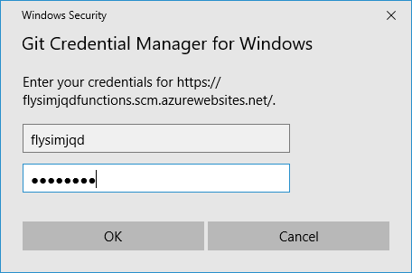
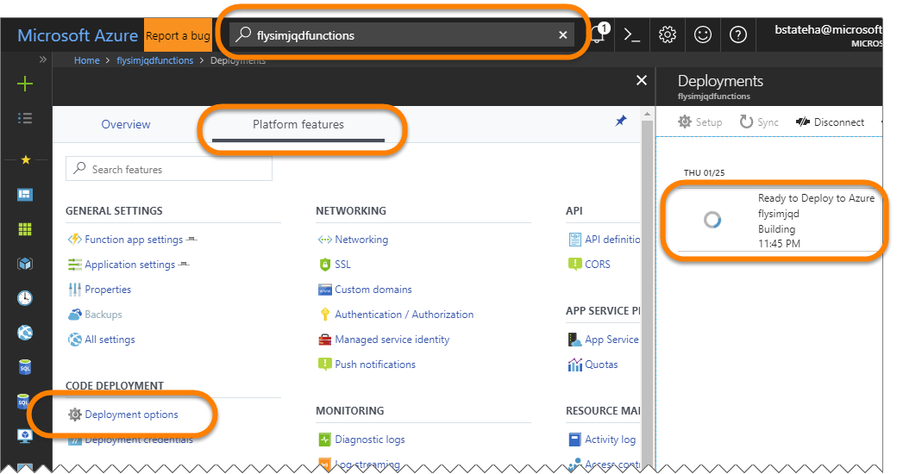
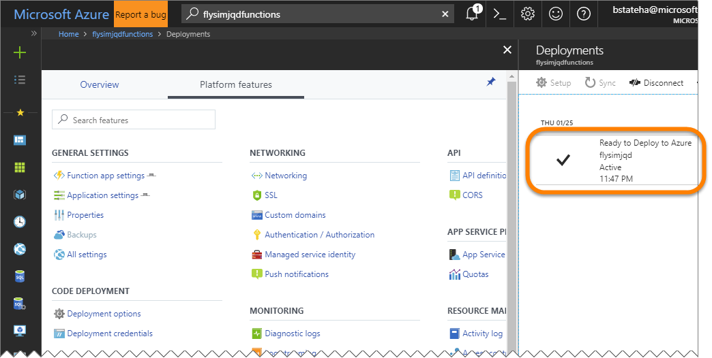
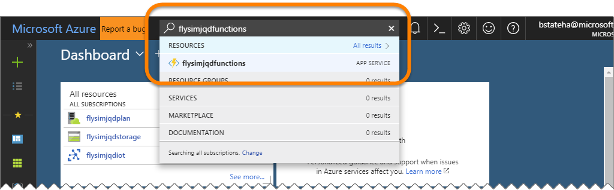
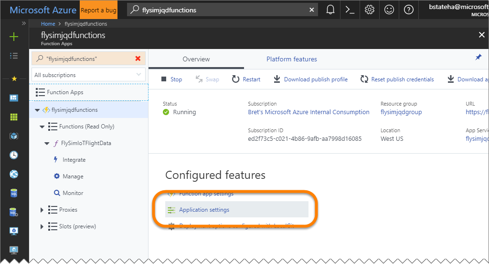
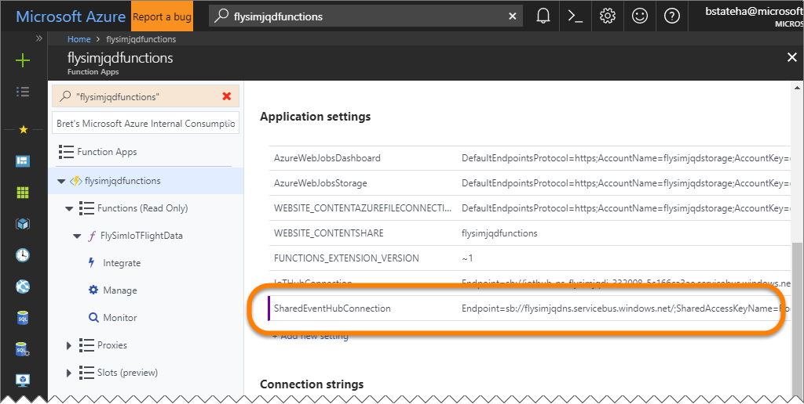
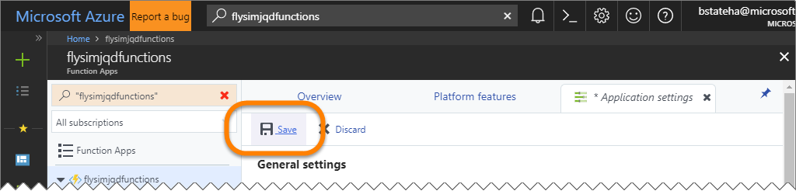
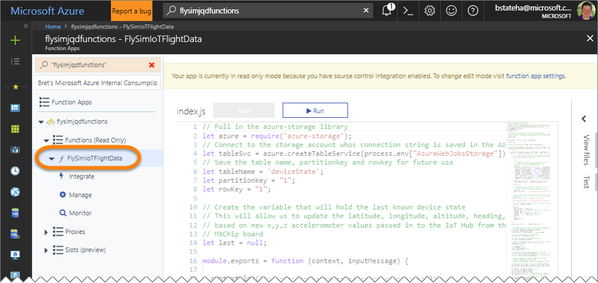
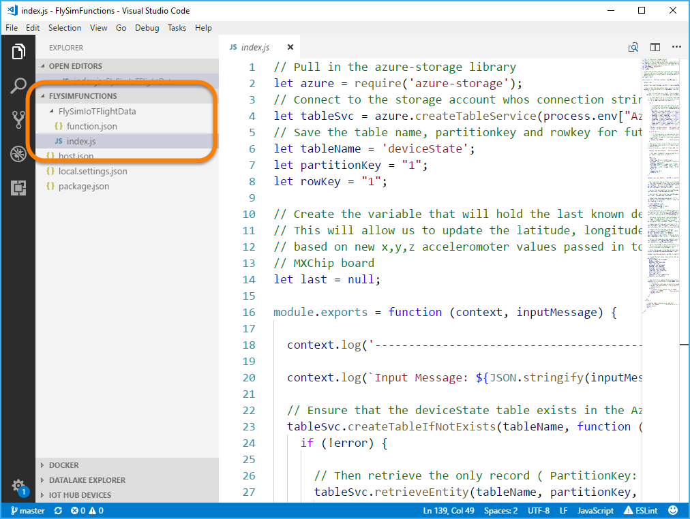
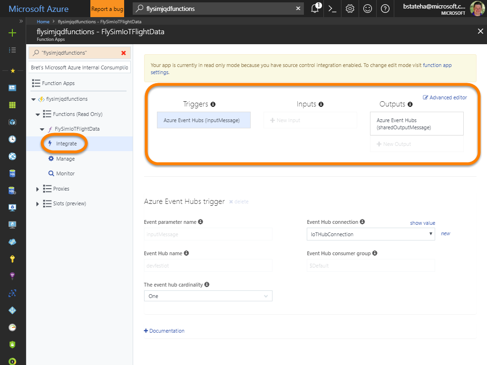

# 03 - Deploy Your Function Code to Azure

## Overview 

In the previous lab "[02 - Deploy and Verify Your Resources in Azure](./flysimexpress-02.md)", we deployed a number of resources including an Azure Function App.  Function Apps are one of the "Serverless Compute" models available in Azure.  They give you an easy way to define some code that you want to execute, when or why that code should run, and what resources it has access to.  You can do all of that without having to go through the trouble of creating Virtual Machines or even traditional Web Apps.

The Azure Function App we created previously however doesn't actually have any CODE yet.  It's just a container for code to exist in, and be executed from.  In this lab, we'll deploy the code for our function.

## What will our function do? 

First, here's a refresh on what our solution architecture looks like:


If you recall from the "[FlySim Express Hands-On Workshop Introduction](./flysimexpress-00.md)", the Azure IoT Developer Kit MXChip device just publishes it's accelerometer x,y & z values to the Azure IoT Hub.  It's the Azure Function that will take that data from the IoT Hub and use it to simulate the flight data (pitch, roll, altitude, heading, latitude and longitude) for a virtual plane.

The Function will generate a new "genesis" or starting state the first time it is run, or when it can retrieve its previous state from Azure Storage.  It then applies the x & y acclerometer values passed to the Azure IoT Hub from the device to update the flight data.  It then saves that state back to Azure Storage so it can retrieve and update it when the next message comes in. 

Finally, the Function will take the flight data it has calculated and pass it along to an Event Hub that was created by the presenter.  The presenter will be running an app that retrieves the flight data from all attendees at the event, and plots them as points on a map, similar to an Air Traffic Control screen.

## How do we deploy code to our function?

Azure Functions actually support a number of ways to provide the code.  You can manually enter or upload the code via the portal, you can deploy the code from source control respositories like git, or you can publish the function code from release management solutions like Visual Studio Team Services, Jenkins, etc. 

For this lab, we will create a git repository in the Function App itself, configure our local copy of the code to use that repository as it's "origin" and then simply push the code from our laptops up to the cloud using git. So cool!

That does however mean that you need to have git installed on your workstation.  If you don't, download it from <a href="https://git-scm.com/downloads" target="_blank">git-scm.com/downloads</a>.  You also need to make sure that you have configured the global `user.name` and `user.email` settings using these commands:

```bash
git config --global user.name "Your Name"
git config --global user.email "Your Email"
```

## Exercises

- [Configure the deployment credentials](#Exercise1)
- [Configure the Azure Function App git Repository](#Exercise2)
- [Deploy your local code to Azure](#Exercise3)
- [Configure the Shared Event Hub Connection](#Exercise4)

___
<a name="Exercise1"></a>

### Configure the deployment credentials and repository

Before we can deploy code to Azure, we need to know how to Authenticate with credentials that have permissions to deploy to our subscription.  These are known as the "**Deployment Credentials**" (shocker).  If you are using a subscription that you are already using for other deployments you can just use the credentials you have already configured.  On the other hand, if you have never configured your credentials before, you will need to do so before you can deploy code to your subscription.

1. From your PowerShell Prompt or Terminal Window, navigate to the "**`FlySimFunctions`**" folder under the location where you extracted the workshop contents to.  For example, if you extracted the workshop zip file to a folder name `/FlySimExpress` off the root of your hard drive, you would enter:

    ```bash
    cd /FlySimExpress/FlySimFunctions
    ```

1. Run the following command to view your existing deployment credentials:

    ```bash
    az functionapp deployment user show
    ```

1. In the output from the previous statement, locate the **`"publishingUserName"`** value and see if you recognize it, and can recall the password for it.

    ```bash
    {
      ...
      "publishingUserName": "flysimjqd",
      ...
    }    
    ```

1. If you have not configured, or do not recall the deployment credentials for your subscription, you can configure them using the following command, passing in your own values for the **&lt;UserName&gt;** and **&lt;UserName&gt;** place holders.  ***IF THIS IS NOT YOUR SUBSCRIPTION, OR YOU HAVE OTHER PROCESSES THAT DEPEND ON THE DEPLOYMENT CREDENTIALS, DO NOT CHANGE THEM***:

    ```bash
    az functionapp deployment user set --user-name <UserName> --password <Password>
    ```

    For example, if we were to use ***flysimjqd*** as our user name and ***P@ssw0rd*** as the password:

    ```bash
    az functionapp deployment user set --user-name flysimjqd --password P@ssw0rd
    ```

1. The output from the previous command should confirm that the user name was set.  The password will NOT be shown however:

    ```bash
    {
      ...
      "publishingUserName": "flysimjqd",
      ...
    }    
    ```

___
<a name="Exercise2"></a>

### Configure the Azure Function App git Repository

A simple way to deploy your code using git source control is to just provision a git repository inside the Azure Function App itself, then push code into it from a remote git repo.  That kind of deployment source is called "Local git repository" because the Function App gets its code from a git repository that is "local" relative to the Function App itself.  In this exercise, you'll configure the git repository in the Azure Function App.

1. From the PowerShell prompt or terminal window, run the following command, replacing the ***&lt;name_prefix&gt;*** place holders with your name prefix:

    ```bash
    az functionapp deployment source config-local-git -g <name_prefix>group -n <name_prefix>functions
    ```

    For example, using ***flysimjqd***

    ```bash
    az functionapp deployment source config-local-git -g flysimjqdgroup -n flysimjqdfunctions
    ```
1. In the output from the prevoius statement, make sure to copy the **`"url"`** value for use in the next exercise:

    ```bash
    {
      "url": "https://flysimjqd@flysimjqdfunctions.scm.azurewebsites.net/flysimjqdfunctions.git"
    }    
    ```

    You really just care about this part:

    ```bash
    https://flysimjqd@flysimjqdfunctions.scm.azurewebsites.net/
    ```
___
<a name="Exercise3"></a>

### Deploy your local code to Azure

Now that we have a git repository configured inside the Azure Function app, we are ready to push our local copy of the code to it.

1. First, in the terminal window, make sure you are in the "**`FlySimFunctions`**" folder under the location where you extracted the workshop contents to, and run the following command to initialize the git repo on your computer:

    ```bash
    git init
    ```

1. Stage all of the files currently in the folder with:

    ```bash
    git add .
    ```

1. Then commit the changes to the repo on your laptop:

    ```bash
    git commit -m "Ready to deploy to Azure"
    ```

1. Next, we'll add the git repo we created inside the Azure Function App previously as the "origin" for the repo on your computer.  Replace the ***&lt;url&gt;*** with the url you copied a couple of steps ago:

    ```bash
    git remote add origin <url>
    ```

    For example, with our ***flysimjqdfunctions*** app:

    ```bash
    git remote add origin https://flysimjqd@flysimjqdfunctions.scm.azurewebsites.net/
    ```

1. Finally we can push the code up to azure with a simple git push using the following command:

    > **Note**: the `-u` in the command below sets `origin/master` as the default "**upstream**" for your repo.  That means in the future you should be able to just run `git push` to push without having the specify `origin master`.

    ```bash
    git push -u origin master
    ```

1. If prompted, enter the deployment credentials you verified above:

    


1. The commmand will take some time to complete, but you can watch its progress in the command prompt:

    ```bash
    Counting objects: 8, done.
    Delta compression using up to 4 threads.
    Compressing objects: 100% (7/7), done.
    Writing objects: 100% (8/8), 3.42 KiB | 700.00 KiB/s, done.
    Total 8 (delta 0), reused 0 (delta 0)
    remote: Updating branch 'master'.
    ...
    remote: Restoring npm packages in "D:\home\site\wwwroot"
    ...
    remote: Deployment successful.
    To https://flysimjqdfunctions.scm.azurewebsites.net/
    * [new branch]      master -> master    
    ```
1. You can also monitor the deployment in the <a href="https://portal.azure.com" target="_blank">Azure Portal</a>:

    

    

___
<a name="Exercise4"></a>

### Configure the Shared Event Hub Connection

Our Azure Function is almost ready to go, the last part of configuration we need to do is to give it the connection information it needs to send data to the Shared "`flysim-shared-input-hub`" event hub created by the Presenter.

If your presenter hasn't yet completed the "**[PRESENTER ONLY - Configure Shared Resources and ATC App](./flysimexpress-presenter.md)**" you will need to wait to complete this task until they have completed the lab, and provided you with the connection string for the "`flysim-shared-input-hub`" event hub.  If on the other hand, you are doing this workshop by yourself and haven't yet performed the steps in that lab, do so now so you can get the connection string you need.

1. Once you have the connection information for the "`flysim-shared-input-hub`" from the "**[PRESENTER ONLY - Configure Shared Resources and ATC App](./flysimexpress-presenter.md)**", open the function app in the <a href="https://portal.azure.com" target="_blank">Azure Portal</a> by searching for it's name from the search box along the top, and clicking on the name of the function in the results:

    

1. On the "**Overview**" tab for your function app, click the "**Application Settings**" link

    

1. On the "**Application Settings*"" blade, scroll down to find the "**SharedEventHubConnection**" setting (you may recall that the Application Settings you see here were created by the ARM template you ran previously.  However there was no way for the ARM template to determine this connection string so we have to provide it manually).

1. Click in the box that reads "**`<SHARED EVENT HUB CONNECTIONSTRING AND ENTITY PATH PROVIDED BY THE PRESENTER>`**" and replace it's contents with the connection string provided by the presenter for the "**`flysim-shared-input-hub`**" event hub.  Make sure to scroll back to the top of the page and click the **SAVE** button:

    

    

___
<a name="Exercise5"></a>

### Review the Azure Function Code

Great, so we've deployed our function to Azure, we've talked about what it does, but we haven't actually looked at the code.  Let's finally do that.  To make it easier to see, we'll just Visual Studio Code on your computer to review the code, but you can also view it in the portal. 

1. The code for your function is visible in the portal if you just click on the name of the "**FlySimIoTData**" function in the ***&lt;name_prefix&gt;functions*** Function App.  However, it is a little hard to see, and it is read only because it was put there by a git deployment.  If you want to edit the code, you need to edit it on your workstation, and redeploy with git.

    


1. To make your code more readable, and possibly be able to edit it, open the Location the "**`FlySimFunctions`**" folder under the folder where you extractded the workshop contents to, and open it with Visual Studio Code. Navigate to the "**`FlySimIotData/index.js`**" file and click on it to view it.

    

1. Review the code, it is pretty heavily documented so it should make sense if you spend a little time to absorb it.  Basically it:

    > **Note**: Notice that the airspeed is hard coded to 384 (around line 76).  That means that your plane travels at a fixed speed that is the same as all of the other attendee's planes.  If you need to speed your plane up to make it easier to cause proximity warnings faster, you could modify that value here, then re-deploy your function using "`git add .`", "`git commit -m 'Changed speed'`" and "`git push`".

    - Attempts to retrieve the flight data from a previous execution from an Azure Storage Table named "`deviceState`".  
    - If it successfully retrieves the previous record, it retrieves the values from it
    - If it can't retrieve the previous record for any reason, it creates a new "genesis" state and picks a starting pitch, roll, altitude, heading, latitude and longitude.
    - It then pulls in the accelerometer x & y values from the message that was input from the IoT Hub and uses them to make reasonable updates to the flight data based on the values.
    - It writes the flight data to the Shared Event Hub "`flysim-shared-input-hub`" created by the presenter
    - It saves the flight data to the Azure Storage Table named "`deviceState`" so it can be read the next time the function runs.

1. Next, open the "**`FlySimIotData/function.json`**" file. It defines:

    - The IoT Hub message trigger that causes the trigger to be executed whenever a new message is sent by the device to the IoT Hub
    - The SharedEventHubConnection that we previously provided a value for in the portal to allow the function to send your flight data to the shared "`flysim-shared-input-hub`" created by the presenter.

1. The configuration provided by the "`function.json`" file is what is visible on the "**Integrate**" page in the portal:

    
    
1. Feel free to checkout the other files in the project.  When you are ready, go ahead on to lab [04 - Deploy The Code to your Device and "Fly"](./flysimexpress-04.md)
