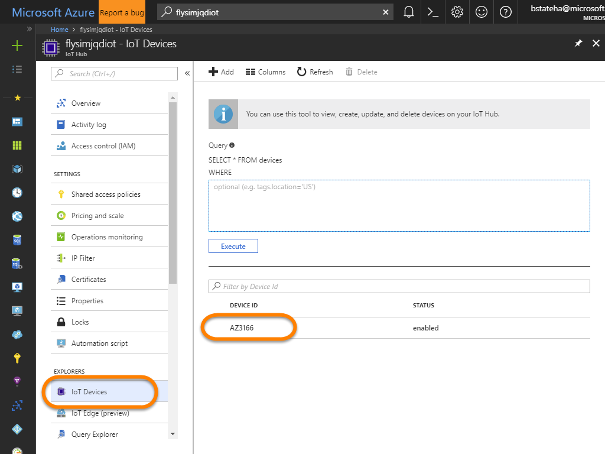
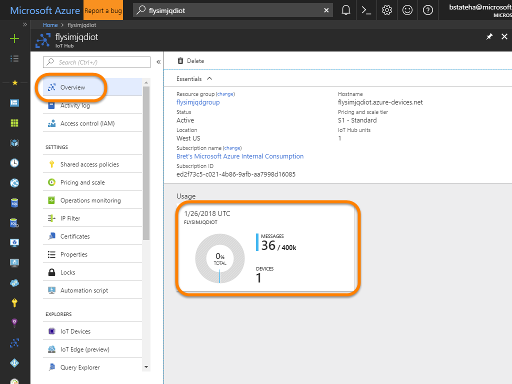
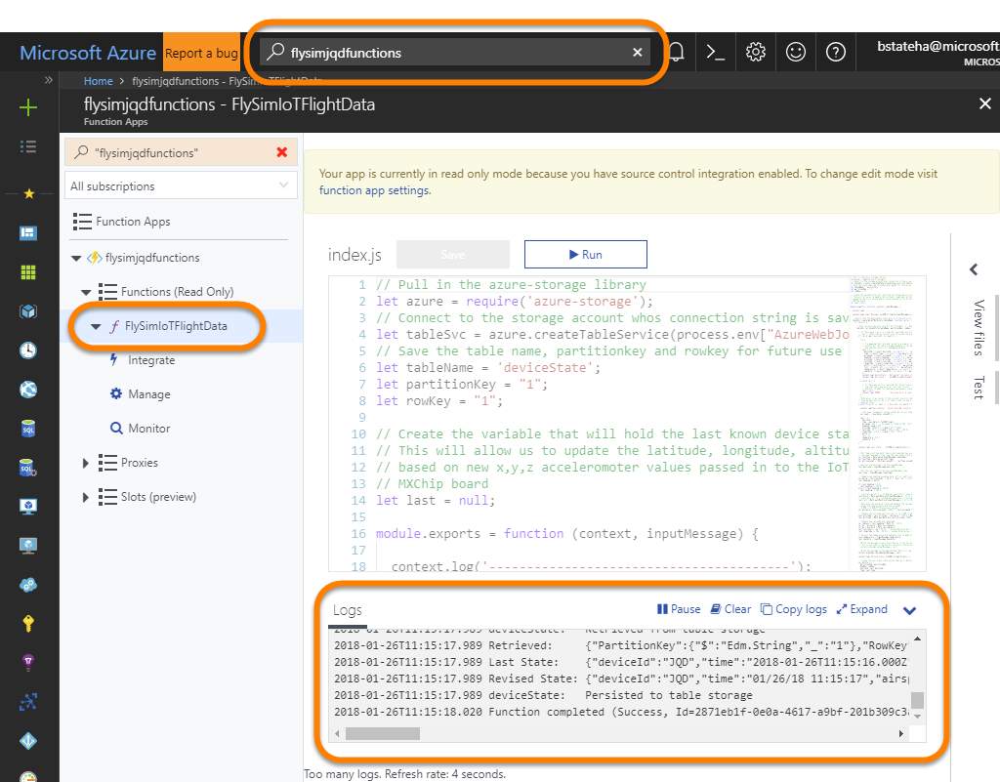
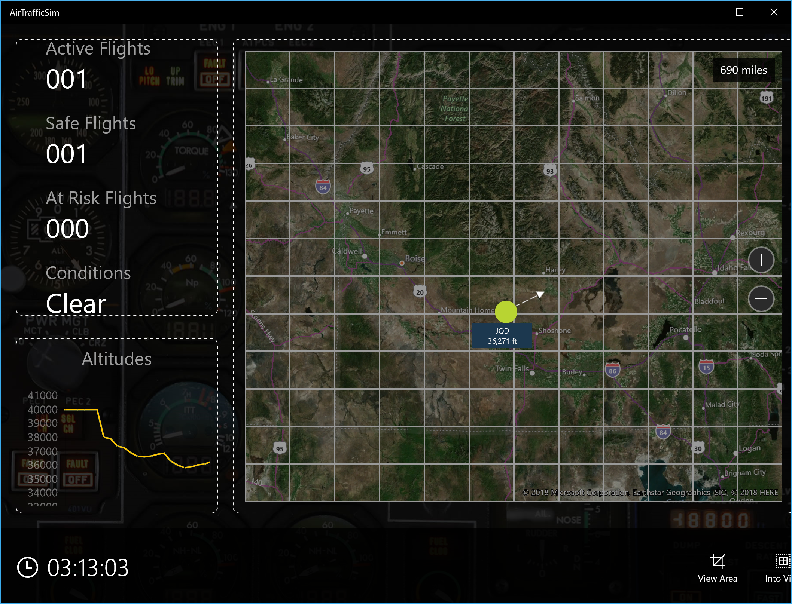

# 04 - Deploy The Code to your Device and "Fly"

At this point our resources in Azure are ready to go, we just need to get our device pushing messages up to our Azure IoT Hub.  To do that, we need to deploy some code to our device. 

In this exercise, you will compile an embedded C++ app that transmits events to your Azure IoT Hub and use Visual Studio Code to upload it to the MXChip. Once the app is uploaded, it will begin executing on the device, and it will send a JSON payload containing three accelerometer values (X, Y, and Z) as well as temperature and humidity readings approximately every two seconds. The app is persisted in the firmware and automatically resumes execution if the device is powered off and back on.

1. Start Visual Studio Code and select **Open Folder...** from the **File** menu. Browse to the "**`FlySimEmbedded`**" folder where you extracted the workshop content to.

1. Open **config.h** and replace YOUR_DISPLAY_NAME with a friendly display name. Then save the file. **This name will be seen by everyone when the ATC app is run in Lab 4**, so please choose a name that's appropriate. Also make it as **unique as possible** by including birth dates (for example, "Amelia Earhart 093059") or other values that are unlikely to be duplicated.

	

    _Entering a display name_
 
1. **For those users on Windows**:

    - Press **F1** and type "terminal" into the search box. Then select **Select Default Shell**.

      

      _Selecting the default shell_

    - Select **PowerShell** from the list of shells to make PowerShell the default shell.

      

        _Making PowerShell the default shell_

1. Select **Run Task** from Visual Studio Code's **Tasks** menu, and then select **cloud-provision** from the drop-down list of tasks. This will begin the process of authorizing your device to access the IoT Hub created in the previous exercise. 

	

    _Starting the cloud-provisioning process_

1. If a "Device Login" screen appears in your browser, copy the login code displayed in Visual Studio Code's Terminal window to the clipboard.

    

    _Getting the device-login code_

    Return to the "Device Login" screen in the browser, paste the login code into the input field, and click **Continue**.

	

    _Logging in to the device_
	 
1. Return to the Terminal window in Visual Studio Code and wait for a list of Azure subscriptions to appear. Use the up- and down-arrow keys to select the Azure subscription that you used to provision the Azure IoT Hub in previously. Then press **Enter** to select that subscription.

1. When a list of IoT Hubs associated with the subscription appears in the Terminal window, select the ***&lt;name_prefix&gt;iot*** hub you provisioned previously.

	

    _Selecting an Azure IoT Hub_

1. Wait until the message "Terminal will be reused by tasks, press any key to close it" appears in the Terminal window. This indicates that the cloud-provisioning process completed successfully. Your MXChip IoT DevKit can now authenticate with the IoT Hub and send messages to it securely.

	

    _A successful cloud-provision task_

1. Now it's time to upload code to the device to have it transmit events to the IoT Hub. Select **Tasks** > **Run Task** again, and then select **device-upload**. 

	

    _Starting the device-upload process_

1. Wait until you are prompted in the Terminal window to "hold on Button A and then press Button Reset to enter configuration mode." Then do the following:

	- Press and hold the **A button** on the device 
	- With the A button held down, press and release the **Reset button**
	- Release the **A button**

	After a brief pause, the C++ app that reads accelerometer data and transmits it to the IoT Hub will begin uploading to your device. If you are curious to see what the source code looks like, examine the CPP files in the project directory in Visual Studio Code. 

1. Wait until the message "Terminal will be reused by tasks, press any key to close it" appears in the Terminal window. After the device restarts, confirm that the message "IN FLIGHT" appears on the screen of the device, followed by X, Y, and Z values that change when you tilt the board in any direction. These are the accelerometer values passed to the IoT Hub. The fact that they appear on the screen confirms that the upload was successful, and that the app is running on the device.

	

    _MXChip IoT DevKit with your embedded code running on it_

## Verify Messages

Now that the code is deployed to your board, you should be able to see messages coming into your Azure IoT Hub, and you can view the logs from your Function's executions.

1. In the <a href="https://portal.azure.com" target="_blank">Azure Portal</a>, search for your ***&lt;name_prefix&gt;iot*** hub, and open it's blade.  Then along the left hand side, click the "**IoT Devices**" link and verify that the "**AZ3166**" device was created:

    > **Note**: the "`cloud-provision`" task you ran in Visual Studio created the device ID for you.  It defaults to creating a device named `AZ3166` if one doesn't already exist in the IoT Hub you select.

    

1. Next, click on the "**Overview**" link and view the number of messages that have been sent into the hub:

    > **Note**: It will take a few minutes for the message count to be updated.  You can go to another page, and then return to the "**Overview**" page to refresh it.

    

1. Next, open the ***&lt;name_prefix&gt;functions*** Function app, click on the "**FlySimIoTData**" function along the left, and then expand the "**Logs**" pane to view the execution logs of the function.  You will see the logged output each time the function is executed because of message being sent by the device to the IoT Hub.

    

1. Lastly, if the Presenter is running the AirTrafficSim app, you can locate your plane's data on it.  As you tilt your board forward/backward and left/right you affect the pitch and roll and therefore it's altitude, heading, latitude, and longitude.  Over time you should see your plane's meta data changing on the AirTrafficSim screen:

    
