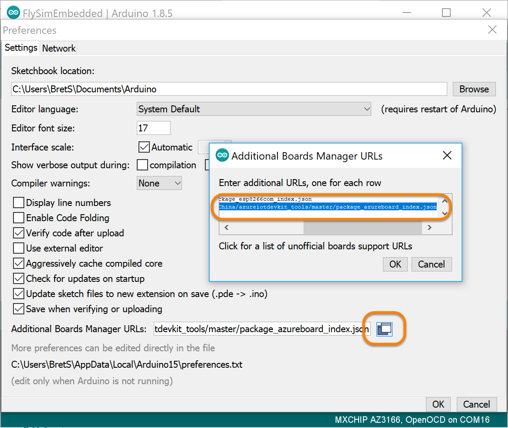
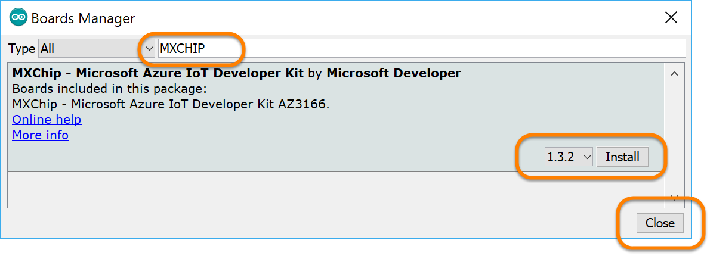
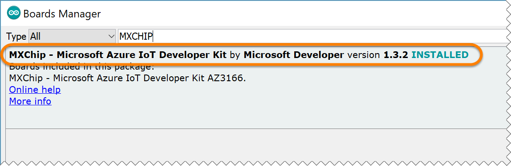
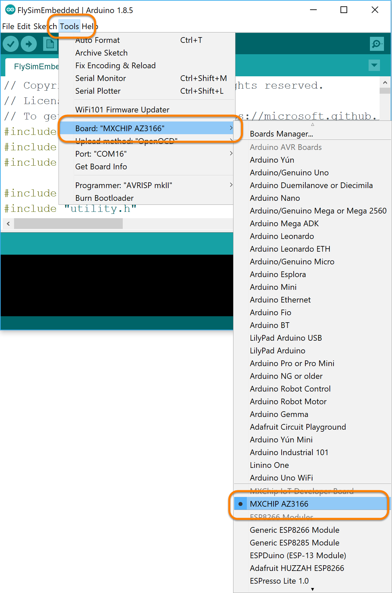
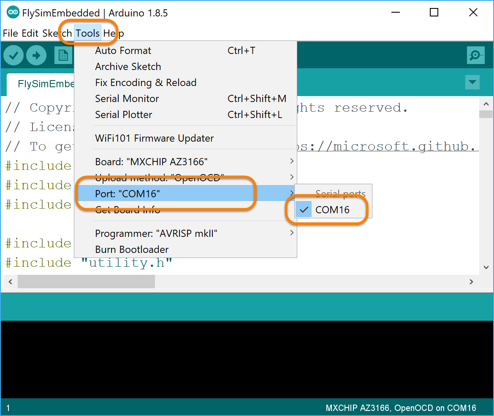
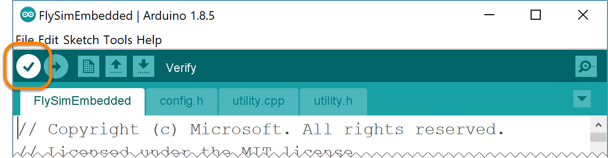
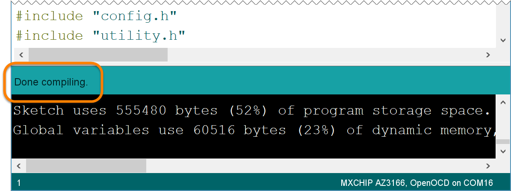
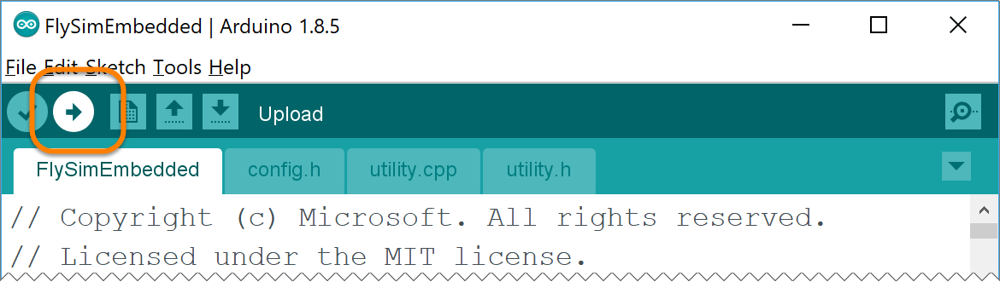
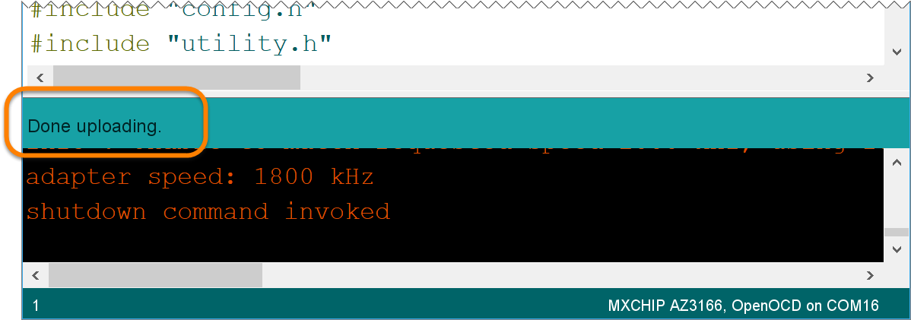

# Frequently Asked Questions

- [How do I find what serial port my board is connected to?](#port)
- [Can I connect to the board using a serial terminal?](#terminal)
- [Can I configure the Board's WiFi Settings Manually?](#wifi)
- [Can I set the board's IoT Hub connection string manually?](#constring)
- [Can I deploy code to the AZ3166 from the Arduino IDE](#arduinoide)
- [Can I complete this workshop on Linux?](#linux)

--- 

<a name="port"></a>

## How do I find what serial port my board is connected to?

- On Windows, open the device manager, and under the **"Ports (COM & LPT)"** heading find the entry for the **"STMicroelectronics Virtual COM Port (COMxx)"** and make note of the COM port shown.  For example in the screen shot below, you can see the board was connected on **COM12**. 

  

- On a Mac:
  - You can see the list of attached serial devices by opening a terminal prompt and running:

    ```bash
    ls /dev/tty.*
    ```
  
  - In the list of displayed devices, locate the one with a name like:

    ```bash
    /dev/tty.usbmodemXXXX
    ```

---

<a name="terminal"></a>

## Can I connect to the board using a serial terminal?

You bet!  You will need to know which serial port your board is connected to.  See [How do I find what serial port my board is connected to?](#port) for help.

To connect to your board using a serial terminal

> **Note**: You should connect at **115200** baud

- **On Windows**, you can use the terminal program of your choice.  If you don't have one, try [PuTTY](https://www.chiark.greenend.org.uk/~sgtatham/putty/latest.html).  Set the connection up as follows, and click the "**Open**" button.

    - Connection type: **Serial**
    - Serial line: **COMxx** (the COM port you discovered above)
    - Speed **115200**

     

- **On Mac**, open a terminal prompt, and use the **screen** utility to connect to the serial port you discovered above at **115200** baud.  Replace the `/dev/tty.usbmodemXXXX` below with the serial port you discovered above:

    ```bash
    screen /dev/tty.usbmodemXXXX 115200
    ```

- Put the board into "Configuration" mode by pressing and holding the "**A**" button while pressing and releasing the "**Reset**" button.  Then releasing the "**A**" button:

  

- The board's display should look similar to:

  

- Once you are connected to the board via the serial terminal, you should see a help screen similar to the following (if not, you might try repeating the "Hold button A down while pressing and releasing the reset button" sequence from above to reset the board again):

    ```text
    ************************************************
    ** MXChip - Microsoft IoT Developer Kit **
    ************************************************
    Configuration console:
    - help: Help document.
    - version: System version.
    - exit: Exit and reboot.
    - scan: Scan Wi-Fi AP.
    - set_wifissid: Set Wi-Fi SSID.
    - set_wifipwd: Set Wi-Fi password.
    - set_az_iothub: Set the connection string of Microsoft Azure IoT Hub.

    #
    ```

---

<a name="wifi"></a>

## Can I configure the Board's WiFi Settings Manually?

Yes, steps for manually configuring the WiFi on the board via a direct serial connection over the USB cable can be found here:

[Azure IoT Developer Kit Manual WiFi Configuration](https://github.com/BretStateham/azure-iot-devkit-manual-wifi)

--- 

<a name="constring"></a>

## Can I set the board's IoT Hub connection string manually?

Yes!

- Get the IoT Hub connection string for your device using the Azure CLI.  
- Ensure you are logged into the Azure CLI

- Run the following command (replacing the `<name_prefix>` place holder with your name prefix):

  ```bash
  az iot device show-connection-string --hub-name <name_prefix>iot --device-id AZ3166
  ```

- Copy the Connection string value from the output:

  ```bash
  {
    "connectionString": "HostName=flysimyvriot.azure-devices.net;DeviceId=AZ3166;SharedAccessKey=NeUH+o2Q9PD3dcRf4GoOXDmx0Qc2zsiBjcyXKl4zlaQ="
  }
  ```

  You only need the connection string itself:

  ```bash
  HostName=flysimyvriot.azure-devices.net;DeviceId=AZ3166;SharedAccessKey=NeUH+o2Q9PD3dcRf4GoOXDmx0Qc2zsiBjcyXKl4zlaQ=
  ```

- Connect to the board using a serial terminal as described in the [Azure IoT Developer Kit Manual WiFi Configuration](https://github.com/BretStateham/azure-iot-devkit-manual-wifi) steps.

- In the serial terminal, enter the command `set_az_iothub` and past in the connection string you just copied from above.   

  ```bash
  set_az_iothub <connection-string>
  ```

  For example, using the connection string from above:

  ```bash
  set_az_iothub HostName=flysimyvriot.azure-devices.net;DeviceId=AZ3166;SharedAccessKey=NeUH+o2Q9PD3dcRf4GoOXDmx0Qc2zsiBjcyXKl4zlaQ=
  ```

  You should get the following response back:

  ```bash
  INFO: Set Azure Iot hub connection string successfully.
  ```

---

<a name="arduinoide"></a>
## Can I deploy code to the AZ3166 from the Arduino IDE

Yes you can! If you are having problems getting the `device-upload` task to work in VS Code, you can try this out:

  > **Note**: These steps assume you have [installed the DevKit](https://microsoft.github.io/azure-iot-developer-kit/docs/get-started/#install-development-environment) for the board.

- Open the `/FlySimExpress/FlySimEmbedded/FlySimEmbedded.ino` file in the Arduino IDE

- First, we need to tell the Arduino IDE where it can find the board manager for the MXChip AZ3166 board.  From the Arduino IDE menu bar, select "**File**" | "**Preferences**", then click the button to the right of the "**Arduino Boards Manager URLs**" text box.  Ensure that the following url is entered (if there are multiple URLs, ensure that each URl is on it's own line).  Click "**OK**" to close the "**Additional Boards Manager URLs**" window, and again to close the "**Preferences**" window.  ***If you made any changes, close and restart the Arduino IDE, and re-open the `FlySimEmbedded.ino` sketch***:

  ```bash
  https://raw.githubusercontent.com/VSChina/azureiotdevkit_tools/master/package_azureboard_index.json
  ```

  

- Next, we need to install the board manager for the board.  From the Arduino IDE menu bar, select "**Tools**" | "**Board:**" | 

  

- Search for the board by typing `MXCHIP` in the search box at the top.  Then select "**1.3.2**" (**MAKE SURE TO SELECT VERSION 1.3.2, THE OTHER VERSIONS HAVE NOT BEEN TESTED**) of the MXChip board from the version drop down list, and click "**Install**".  Once it is installed, click "**Close**"

  

  > **Note**: Ensure that the board manager **1.3.2** shows as installed:

  

- Now, tell the Arduino IDE to use the MXChip board manager.  From the Arduino IDE menu bar, select "**Tools**" | "**Board:**" | "**MXCHIP AZ3166**"

  

- Then, configure it to use the serial port that your board is connected to.  From the Arduino IDE menu bar, select "**Tools**" | "**Port:**" then select the port that your board is attached to:

  > **Note**: Your MXChip AZ3166 board must be plugged into your computer at this time via the USB cable.

  

- Next, make sure the code compiles by clicking on the "**Verify**" button in the Arduino IDE tool bar. 

  > **Note**: It may take a few minutes to compile the code.

  

  Ensure that the code compiles successfully, with no errors:

  


- Before you upload the code to the board, put the board into "Configuration" mode by pressing and holding the "**A**" button while pressing and releasing the "**Reset**" button.  Then releasing the "**A**" button.  The board's display should now read something like:

    ```text
    IoT DevKit
    id:xxxxxxxxxxxx
    Configuration
    ```

- Then click the "**Upload**" button on the Arduino IDE to upload the code to the board.  When the IDE is actually uploading code to the board, you should see the lights on the MXChip board flash.  Verify that the upload worked.

  > **Note**: It may take a few minutes to upload the code to the board

  

  Ensure that the upload succeeded without error

  

- The board should reboot and begin running the code.  If it still isn't working, you should first verify that 

  - The WiFi is properly configured on the baord
  - The IoT Hub Device Connection String is properly configured on the board 

---

<a name="linux"></a>
## Can I complete this workshop on Linux?

Linux operating systems are formally supported in this workshop.  That said, if you are up for the challenge you can look into getting the tools installed on your linux distribution to work with the board.  This article shows you how Noel Bundick got it working on Ubuntu 16.04:

[Using the Azure IoT DevKit with Linux](https://www.noelbundick.com/posts/using-the-azure-iot-devkit-with-linux/)


