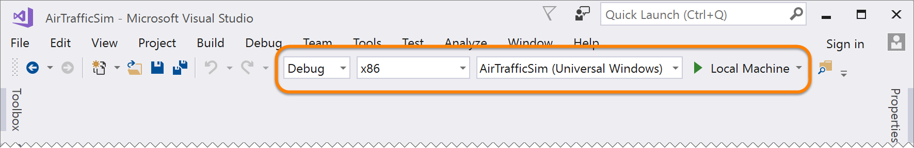
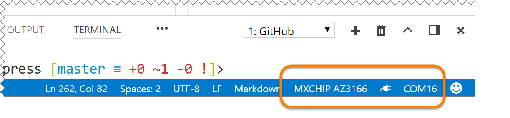

# FlySimExpress - Just the Steps

## Architecture Overview


## Prereqs

- A Windows or Mac computer.

- On macOS machines, you  will need to [install Homebrew](https://docs.brew.sh/Installation.html)

- You also need to have your git global config setup with the user and email. To ensure the global config options, run the following commands from your command prompt or terminal window after installing git:

  ```bash
  git config --global user.name "Your Name"
  git config --global user.email "Your Email"
  ```

- An active Azure Subscription

- If you are at an event, get the USB stick with the content and software files on it. 

- If you are on your own, grab the content from http://aka.ms/FlySimExpress.  

    - Download it to your computer
    - Unblock it before extracting if you are on Windows
    - Extract it, remembering where you put it.  This is the workshop content. 

## 01 - Prepare the Azure IoT Development Kit Board

1. Follow the <a href="https://microsoft.github.io/azure-iot-developer-kit/docs/get-started/" target="_blank">Get Started</a> guide.

    - Configure WiFi
    - Upgrade Firmware
    - Install the DevKit for Windows or macOS

## 02 - Deploy and Verify Your Resources in Azure

1. Choose the ***&lt;name_prefix&gt;*** you wish to use.  Make sure to be consistent in the name you use.  You may want to jot this down so you can remember it later.  ***flysim*** and and your initials is recommended.  For example, John Q. Doe would use:

    ```bash
    fysimjqd
    ```

1. From a PowerShell prompt on Windows (not cmd or bash on windows) or a terminal window on macOS verify that the Azure CLI is version 2.0 or later:

    ```bash
    az --version
    ```

1. Login to the Azure CLI and verify the right subscription is being used:


    ```bash
    az login
    ```

    ```bash
    az account list --help
    az account set --help
    az account show --help
    ```

1. Change into the FlySimExpress/AzureResources/Attendee folder under the workshop content:

    ```bash
    cd FlySimExpress/AzureResources/Attendee
    ```

1. Create the resource group

    ```bash
    az group create --resource-group <name_prefix>group --location westus
    ```

1. Deploy the Attendee ARM template:

    ```bash
    az group deployment create --name "FlySimAttendee" --resource-group <name_prefix>group --template-file .\template-express.json --parameters name_prefix=<name_prefix>
    ```

1.  Verify the resources

    ```bash
    az resource list --resource-group <name_prefix>group
    ```

# PRESENTER ONLY - Configure Shared Resources and ATC App

1. Change in to the Presenter resources folder

    ```bash
    cd FlySimExpress/AzureResources/Presenter
    ```

1. Create the resource group (if you don't have one already)

    ```bash
    az group create --resource-group <name_prefix>group --location westus
    ```

1. Deploy the ARM template

    ```bash
    az group deployment create --name "FlySimPresenter" --resource-group <name_prefix>group --template-file .\template-presenter.json --parameters name_prefix=<name_prefix>
    ```

1.  Verify the resources

    ```bash
    az resource list --resource-group <name_prefix>group
    ```

1. Copy the **`sharedInputHubConnectionString`** from the outputs and share it for the attendees to put into the Function App App Settings

    ```bash
    {
      ...
      "properties": {
        ...
        "outputs": {
          ...
          "sharedInputHubConnectionString": {
            "type": "String",
            "value": "Endpoint=sb://flysimjqdns.servicebus.windows.net/;SharedAccessKeyName=RootManageSharedAccessKey;SharedAccessKey=X5cTD6Gu6CUb5O5VD4RtqBkenPcnLQAHIB/X78sz+pY=;EntityPath=flysim-shared-input-hub"
          },
          ...
        }
      }
    }
    ```
1. Additionally, In the output from the previous command, locate the "**`NamespaceConnectionString`**" output property for your own use in the AirTrafficSim app in the in the next exercise

    ```bash
    {
      ...
      "properties": {
        ...
        "outputs": {
          "namespaceConnectionString": {
            "type": "String",
            "value": "Endpoint=sb://flysimjqdns.servicebus.windows.net/;SharedAccessKeyName=RootManageSharedAccessKey;SharedAccessKey=X5cTD6Gu6CUb5O5VD4RtqBkenPcnLQAHIB/X78sz+pY="
          },
          ...
        }
      }
    }    
    ```

1. Open the "**`FlySimExpress/AirTrafficSim`**" solution from the workshop content in Visual Studio 2017 Community Edition or later.

1. In Visual Studio, open the "**CoreConstants**" file, and paste the "**`NamespaceConnectionString`**" value you copied into the last exercise in for the `SharedEventHubEndpoint` variable value.

1. Set the debug target in Visual Studio to "**x86**" and "**Local Machine**"

    

1. Run the app and keep it on the event screen so attendees can verify their plane is appearing on it.
    
## Update the Zoom Level Visibility

If you want plane metadata (name, direction) to be visible when you are zoomed out further, you can modify line 165 in the "`MainViewModel.cs`" file. Change the **`90`** to a larger value if you want to see metadata when you are zoomed out more.   I'd recommend a much larger value, like **`1100`** or so.

  ```c#
  plane.ZoomDeepLevel = (value < 90) ? Visibility.Visible : Visibility.Collapsed;
  ```


# 03 - Deploy Your Function Code to Azure

1. Change into the FlySimFunctions folder

    ```bash
    cd FlySimExpress/FlySimFunctions
    ```

1. Verify and/or set your Azure deployment user credentials

    ```bash
    az functionapp deployment user show
    ```

     ```bash
    az functionapp deployment user set --user-name <UserName> --password <Password>
    ```

1. Configure the Azure Function App we deployed above to use Local Git deployment

    ```bash
    az functionapp deployment source config-local-git -g <name_prefix>group -n <name_prefix>functions
    ```

1. Copy the git deployment URL (just the url, not the whole JSON) from the output of the previous command:

    ```bash
    {
      "url": "https://flysimjqd@flysimjqdfunctions.scm.azurewebsites.net/flysimjqdfunctions.git"
    }    
    ```

1. Initialize the git repo in the copy of the function code on your laptop

    ```bash
    git init
    ```

    ```bash
    git add .
    ```

    ```bash
    git commit -m "Ready to deploy to Azure"
    ```

1. Add the git deployment URL for the function app in the cloud as the origin for the repo on your laptop

    ```bash
    git remote add origin <url>
    ```

1. Push the local repo on your laptop up to Azure. Monitor the output in the command prompt or in the "Deployment Options" blade for the function app in the portal. 

    ```bash
    git push -u origin master
    ```

1. Update the SharedEventHubConnection application setting using the **`sharedInputHubConnectionString`** from the presenter:

    ```bash
    az functionapp config appsettings set --settings SharedEventHubConnection=<connection_string> -n <name_prefix>functions -g <name_prefix>group
    ```

# 04 - Deploy The Code to your Device and "Fly"

1. Make sure the MXChip board is connected to your computer's USB board.

1. Open the FlySimEmbedded project in code

    ```bash
    cd FlySimExpress/FlySimEmbedded
    code .
    ```

1. In VS Code, open the `config.h` file, and replace `YOUR_DISPLAY_NAME` with your initials or short name (this is what will appear in the presenters ATC app).

1. If you are on Windows

    - Press `F1` to open the VS Code Command Pallette
    - Select **Terminal: Select Default Shell**
    - Select **PowerShell**

1. From the VS Code menu bar, select **Tasks** | **Run Task..** | **cloud-provision**

1. Click in the terminal window that is opened to make it the active window in VS Code.

1. Follow the process to login to the Azure CLI if necessary

1. Follow the prompts in the terminal window to select your subscription and the IoT Hub we provisioned with the ARM template

1. Put your MXCHip board in "Configuration Mode".  Press and Hold the **A Button**.  Press and Release the **Reset Button**.  Release the **A Button**

1. In the VS Code Status bar, ensure that it sees your MXChip Board and COM PORT:

    

1. From the VS Code menu bar, select **Tasks** | **Run Task..** | **device-upload** to compile and upload the code.  **THIS WILL TAKE A FEW MINUTES THE FIRST TIME**

1. Verify that the **cloud-provision** task created the **AZ3166** device in the IoT Hub:

    

1. Verify messages are arriving in your iot hub (will take a few minutes for the count to increase)

    

1. Review the Log of the Function App:

    

1. Look for your plane in the AirTrafficSim app:

    

1. Tilt your MXChip board forward/backward (Screen Side is "UP", USB Port edge is "FRONT") and left/right to "fly" your plane. 

1. Try to get very close to another plane to see them both turn red

  - The Stream Analytics job created by the presenter is looking for close planes, sending a warning to the "flysim-shared-output-hub" and and AirTrafficSim app is getting those warnings and coloring the planes involved red. 


