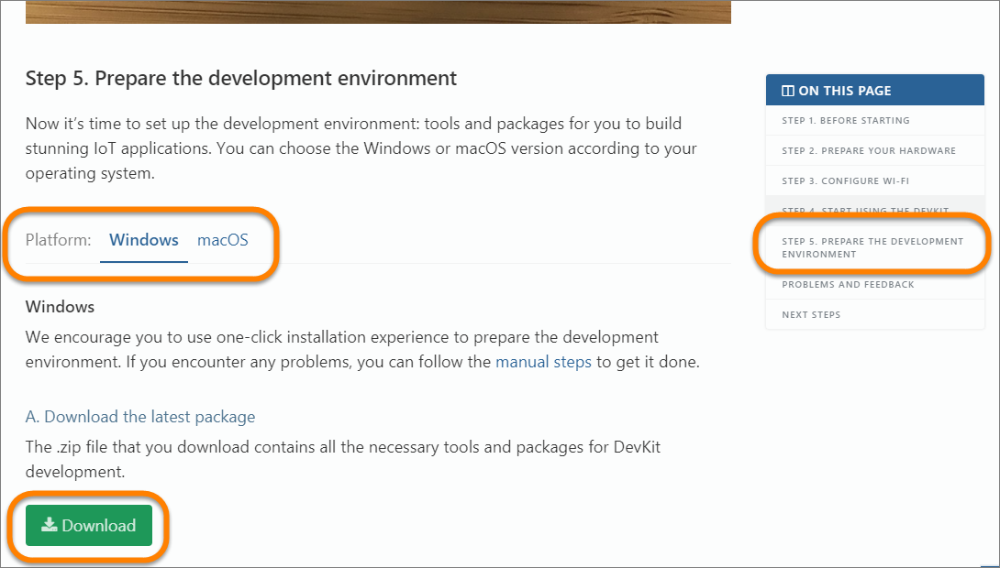

# IoT DevFest 2018 Azure IoT Workshop Prerequisites

In order to successfully complete this workshop as an attendee, you will need:

- A Windows or Mac computer.

- On macOS machines, you  will need to [install Homebrew](https://docs.brew.sh/Installation.html)


- You also need to have your git global config setup with the user and email. To ensure the global config options, run the following commands from your command prompt or terminal window after installing git:

  ```bash
  git config --global user.name "Your Name"
  git config --global user.email "Your Email"
  ```

- An active Azure Subscription that you are willing to use for the resources you will create during the event.  If you delete the resources as instructed at the end of the event, the total cost for the resources shouldn't be more than a few US dolalrs.

  If you don't have an active Azure Subscription, or don't want charges billed to your existing subscription, you can create a free trial at [http://azure.com/free](http://azure.com/free). If you have created a free trial previously, you will need to create a new one using a different email address.  The recommended steps for creating a free trial for the event are:

    > **Note**: A credit card is required as part of the Free Trial sign up process.  No charges will be applied to the card, it is used just for identity verification purposes.

    1. Open a private browser session
    1. Go to http://outlook.com and create a new somename@outlook.com account
    1. Still in the same private browser session, navigate to http://azure.com/free and complete the free trial registration using your new outlook.com address, but with your real phone number and credit card for verification purposes.

## For the ambitious only...

You will additionally need some other tools that are installed by the DevKit package.  However, the instructions for installing them assume you already have the board in hand (we'll have boards at the workshop). 

That said, if you want to complete the portion of that setup that runs on your computer you can:

1. Complete JUST <a href="https://microsoft.github.io/azure-iot-developer-kit/docs/get-started/#step-5-prepare-the-development-environment" target="_blank">Step 5. Prepare the development environment</a> from the developer kit "Get Started" documentation.

1. Make sure to follow the steps for your platform (Windows or macOS)

  

1. Follow the remaining instructions to insatll the DevKit for your platform.
